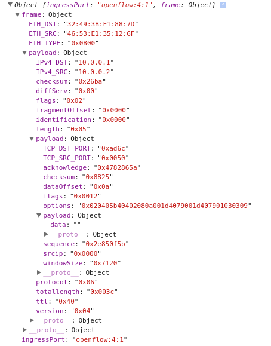

## pkt-json-str

The 'pkt' field of TraceTree history response is as follows.


```json

"pkt": {
        "pkt-str": "MaplePacket [ingressPort=openflow:4:5, frame=\nip\ndl_vlan: untagged\ndl_vlan_pcp: 0\ndl_src: ae:ac:d2:9b:df:d2\ndl_dst: d6:32:66:a8:86:0f\nnw_src: 10.0.0.1\nnw_dst: 10.0.0.2\nnw_tos: 0\nnw_proto: 6\ntcpsrc: 37364\ntcpdst: 80]",
        "timestamp": "29-04-2017 13:52:40:852",
        "pkt-json-str": "{\"ingressPort\":\"openflow:4:5\",\"frame\":{\"payload\":{\"fragmentOffset\":\"0x0000\",\"IPv4_DST\":\"10.0.0.2\",\"IPv4_SRC\":\"10.0.0.1\",\"length\":\"0x05\",\"flags\":\"0x02\",\"version\":\"0x04\",\"diffServ\":\"0x00\",\"ttl\":\"0x40\",\"protocol\":\"0x06\",\"identification\":\"0xa13f\",\"payload\":{\"sequence\":\"0x00f5b4af\",\"dataOffset\":\"0x0a\",\"windowSize\":\"0x7210\",\"srcip\":\"0x0000\",\"TCP_DST_PORT\":\"0x0050\",\"acknowledge\":\"0x00000000\",\"payload\":{\"data\":\"\"},\"flags\":\"0x0002\",\"checksum\":\"0x5f21\",\"options\":\"0x020405b40402080a055115900000000001030309\",\"TCP_SRC_PORT\":\"0x91f4\"},\"totallength\":\"0x003c\",\"checksum\":\"0x857a\"},\"ETH_SRC\":\"AE:AC:D2:9B:DF:D2\",\"ETH_DST\":\"D6:32:66:A8:86:0F\",\"ETH_TYPE\":\"0x0800\"}}",
        "traceitemlist": [
            //......
        ]
      }

```

The 'pkt-json-str' field can be parsed as JSON Object like this.

```js
var i=0;
function test(){
     $.ajax({  
         url: 'http://localhost:8181/restconf/operational/maple-tracetree-history:tracetreehistory/history/'+i+'/',
         type: 'GET',
         dataType: 'json',
         timeout: 1000,
         cache: false, 
         beforeSend: LoadFunction, 
         error: erryFunction,
         success: succFunction
     })
     function LoadFunction(xhr){
        xhr.setRequestHeader("Authorization", "Basic " + "YWRtaW46YWRtaW4=");  
     }
     function erryFunction(){ 
         alert("error");  
     }
     function succFunction(tt){
     	i++;
     	str=tt.history[0].pkt['pkt-json-str'];
     	t1=JSON.parse(str);
     	console.log(tt);
     	console.log(t1);
     }
}

```

the JSON Object is a hierarchical structure like this, all fields except 'ETH_DST', 'ETH_SRC', 'IPv4_DST' and 'IPv4_SRC' are encoded in hexadecimal.




